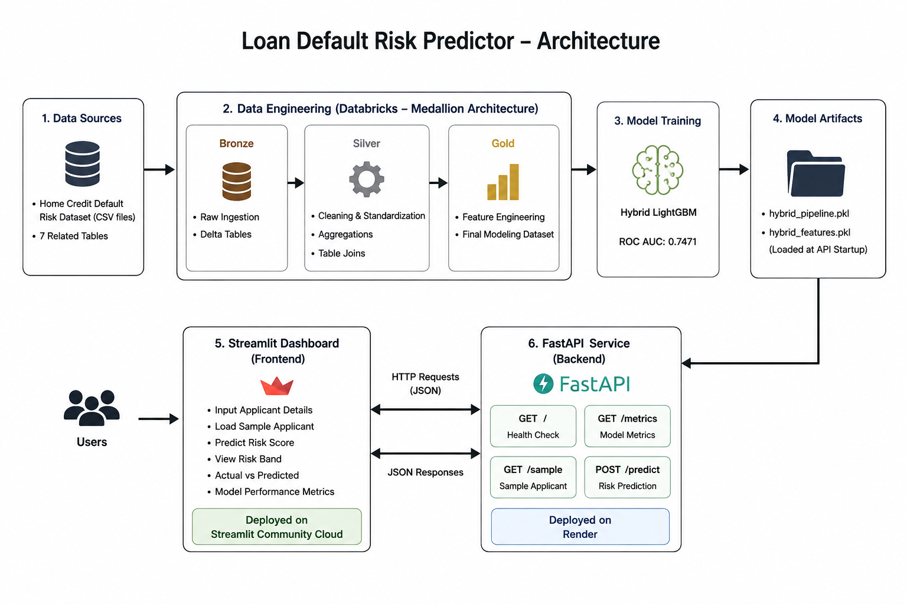

# Loan Default Risk Predictor

An end-to-end machine learning system for predicting loan default risk using the Home Credit Default Risk dataset. The project demonstrates a complete MLOps workflow from data engineering and feature engineering to model deployment and interactive risk assessment.

---

## Architecture



```text
docs/architecture.png
```

---

## Overview

This project uses a Hybrid LightGBM model trained on financial, demographic, bureau history, and previous application features to predict the probability of loan default.

The system consists of:

* Databricks Medallion Architecture (Bronze → Silver → Gold)
* Hybrid LightGBM model
* FastAPI inference service
* Streamlit dashboard
* Deployment on Render and Streamlit Cloud

---

## Dataset

**Dataset:** Home Credit Default Risk

* Training rows: 307,511
* Final deployment features: 25
* Target: Loan Default (Binary Classification)

---

## Data Pipeline

The data engineering pipeline follows a Medallion Architecture implemented in Databricks.

### Bronze

* Raw CSV ingestion
* Delta tables

### Silver

* Missing value handling
* Duplicate removal
* Bureau aggregations
* Previous application aggregations
* Table joins and standardization

### Gold

* Feature engineering
* Risk-related feature creation
* Exported modeling dataset

Databricks notebooks are exported as HTML and available in the `docs/` directory.

---

## Model

### Hybrid LightGBM (Deployment Model)

Feature categories:

* Financial information
* Demographic information
* External risk scores
* Bureau credit history
* Previous applications
* Engineered risk features

### Performance

| Metric    |  Value |
| --------- | -----: |
| ROC AUC   | 0.7471 |
| Accuracy  | 0.7497 |
| Precision | 0.1817 |
| Recall    | 0.5996 |
| F1 Score  | 0.2789 |

---

## API

The model is served using FastAPI.

### Endpoints

| Method | Endpoint   | Description      |
| ------ | ---------- | ---------------- |
| GET    | `/`        | Health check     |
| GET    | `/metrics` | Model metrics    |
| GET    | `/sample`  | Sample applicant |
| POST   | `/predict` | Risk prediction  |

### API URL

https://home-credit-default-risk-api-ny4s.onrender.com

### Swagger Documentation

https://home-credit-default-risk-api-ny4s.onrender.com/docs

---

## Streamlit Dashboard

https://home-default-risk.streamlit.app/

The dashboard provides:

* Interactive applicant form
* Sample applicant loading
* Risk score prediction
* Risk bands (Low / Medium / High)
* Actual vs Predicted comparison
* Model performance metrics

---

## Deployment

### Backend

* FastAPI
* Render

### Frontend

* Streamlit
* Streamlit Community Cloud

---

## Repository Structure

```text
home-default-risk/

├── app/
│   ├── main.py
│   ├── schemas.py
│   └── streamlit_app.py

├── data/
│   └── demo_cases.csv

├── docs/
│   ├── 01_bronze_ingestion.html
│   ├── 02_silver_process.html
│   ├── 03_gold_process.html
│   └── architecture.png

├── models/
│   ├── hybrid_pipeline.pkl
│   └── hybrid_features.pkl

├── notebooks/
│   ├── pipeline.ipynb
│   └── train_demo_model.ipynb

├── requirements.txt
├── .python-version
└── README.md
```

---

## Tech Stack

* Python
* Databricks
* Apache Spark
* LightGBM
* FastAPI
* Streamlit
* Pandas
* Scikit-learn
* Render
* Streamlit Community Cloud

---

## Author

**Kshitij Maurya**

AI/ML Engineer specializing in Machine Learning, Data Science, and MLOps.
